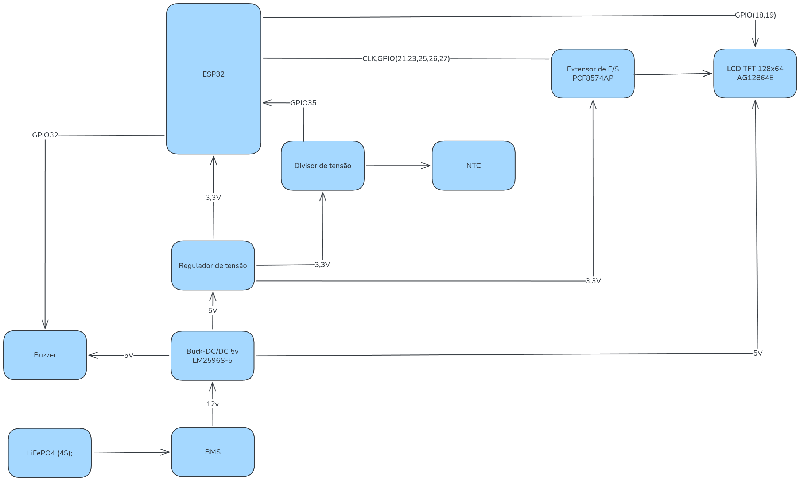
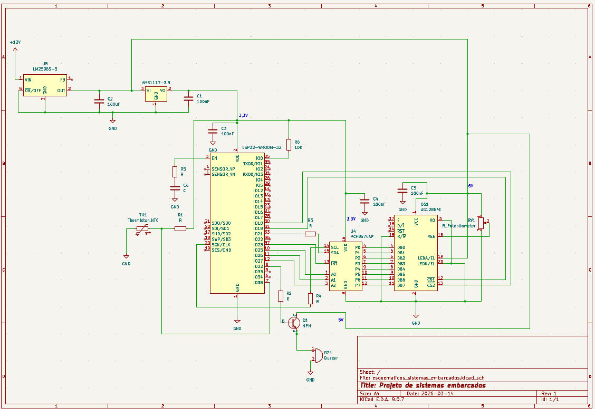

# sistemas_embarcados
Repositorio com codigos fontes e documentação para a cadeira de sistemas embarcados do curso de engenharia da computação do IFPB

## Atividade 1

    Atividade: Elabore os diagramas de bloco para um Sistema de monitoramento de temperatura:
    Faixa de temperatura do sensor : 0°C a 100°C;
    Alarmes: sonoro;
    Display: LCD TFT 128x64;
    Alimentação: Bateria LiFePO4 (4S);

 

 ## Atividade 2

    Elabore o diagrama esquemático para o sistema de monitoramento de temperatura com base no diagrama em bloco da atividade 1.

